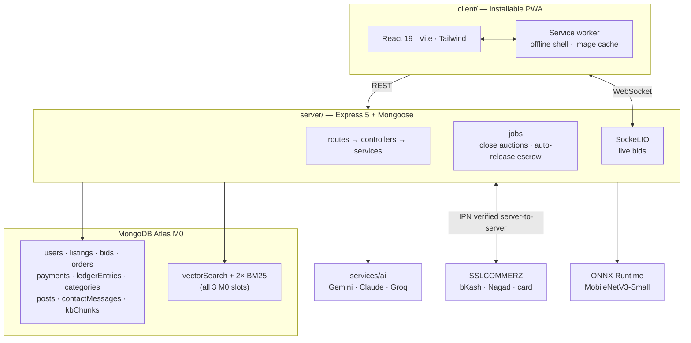

# KrishiBid

[](https://github.com/golammoula287/Krishibid_Software/actions/workflows/ci.yml)


A supplier-to-buyer **agricultural marketplace** — auctions *and* fixed-price shops — with
**escrow payments**, **managed delivery**, **CNN crop-disease detection**, and a **Bangla RAG
advisory assistant**, built for smallholder farmers in Bangladesh.

> **Live client:** <https://krishibid.vercel.app>
>
> **Status:** frontend deployed, 165 passing tests, verified end-to-end against live
> MongoDB Atlas and Gemini. The API is not deployed on serverless — it cannot be
> (interval jobs, WebSockets, native ONNX/sharp binaries), so it needs Render or similar; see
> [Deployment](#deployment-free-tier). The disease model ships as a placeholder until the
> training notebook is run.

---

## Sign in and look around

Run `npm run seed` and these four accounts exist. **Password for every one of them:
`12345678`.** Either the email or the phone number works in the single login field.

| Role | Email | Phone | What they can do |
|---|---|---|---|
| **Super admin** | `rakibmoula2001@gmail.com` | `01700000001` | Everything below, **plus** appointing and demoting administrators |
| **Admin** | `gmrakib2001@gmail.com` | `01700000002` | Approve suppliers, dispatch deliveries, answer messages, suspend accounts, edit categories and the blog |
| **Supplier** | `suplier@gmail.com` | `01700000003` | List produce as an auction or at a fixed price, accept bids, ship orders |
| **Buyer** | `buyer@gmail.com` | `01700000004` | Bid, buy now, pay through escrow, choose delivery, confirm receipt |

There is a fifth seeded account you are not meant to log in as:
`pending-supplier@krishibid.invalid` sits in the review queue on purpose, so that an admin
opening the dashboard has a real application to approve or reject rather than an empty list.

Two notes on those addresses. `suplier@gmail.com` is spelled exactly as requested — it is not a
typo waiting to be fixed, and correcting it would break the credentials people have been given.
And `12345678` is a demo password for a demo database: it is fine here and must not survive
contact with anything real. Change `ACCOUNT_PASSWORD` in `server/src/scripts/seed.ts`, or
rotate the passwords after seeding, before pointing this at a database that matters.

### Proving the logins actually work

```bash
npm run verify:logins       # on a deployed box: npm run verify:logins:prod
```

This drives the real `login()` for all four accounts, by email **and** by phone, and prints what
a person would experience:

```
PASS  super admin  by email rakibmoula2001@gmail.com   role=superadmin
PASS  super admin  by phone 01700000001                role=superadmin
PASS  admin        by email gmrakib2001@gmail.com      role=admin
...
suppliers: 10   buyers: 5   awaiting approval: 1
ALL LOGINS WORK
```

A seed that reports success only proves it wrote rows. Whether anybody can sign in with those
rows depends on the password hash, the account status, the role gates and the identifier lookup —
every one of which has been wrong at some point in this project's history, which is why this
script exists rather than a note saying it should be fine.

---

## The problem

A smallholder farmer in Bangladesh sells through layers of intermediaries who each
take a margin, with no visibility into a fair price. Separately, crop disease that a
photo could catch early is usually caught after yield is already lost, because expert
advice does not reach a non-English-speaking user on a low-end phone at the moment
they need it.

Three pillars address exactly that:

| Pillar | What it does |
|---|---|
| **Marketplace** | Suppliers list in a category, as a live auction or at a fixed price; escrow holds the money until delivery is confirmed |
| **Disease detection** | Photo of a leaf → top-3 diagnosis with confidence, and a remedy — or an explicit "not sure, see an officer" |
| **Bangla RAG advisor** | Farming questions in Bangla, answered **only** from a cited knowledge base |

---

## Architecture



Shared Zod schemas in `shared/` are the single source of truth for the API contract —
a field renamed on one side is a compile error on the other.

---

## Quick start

```bash
git clone <your-repo-url> && cd Krishibid
npm install
cp .env.example .env      # then fill in the blanks below
npm run seed              # wipes, then seeds accounts, 13 categories, 40 listings, bids, one order
npm run verify:logins     # proves you can actually sign in
npm run dev               # server :5000 + client :5173
```

Open <http://localhost:5173> and sign in with any account from
[the table above](#sign-in-and-look-around), or use a **one-click demo login** on the login page.

> `npm run seed` **empties the database first**. That is the point of it — a seed that
> layered on top of whatever was there produced a database nobody could reason about — but it
> means never pointing it at a database holding anything you want to keep.

### Minimum `.env` to boot

| Key | Where to get it |
|---|---|
| `MONGODB_URI` | [Atlas](https://www.mongodb.com/cloud/atlas/register) → free M0 cluster |
| `JWT_ACCESS_SECRET`, `JWT_REFRESH_SECRET` | `openssl rand -base64 48` (twice) |
| `GEMINI_API_KEY` | [AI Studio](https://aistudio.google.com/apikey) — free |

**Swapping the AI provider** is one env var: `AI_PROVIDER=gemini` (default), `claude`,
or `groq`. Only Gemini offers embeddings, so `GEMINI_API_KEY` is required either way —
the factory throws at boot if it is missing rather than silently returning no results.

Everything else is optional in development. Without Cloudinary, images are stored
inline; without SSLCOMMERZ, payment routes return 503; without the ONNX model,
`/api/diagnosis` returns 503; without mail configured, signup still works — the rest of
the app runs regardless.

---

## The marketplace

Two shops, because two entirely different things were being forced through one screen.

| | **Bid shop** (`/market`) | **Fixed-price shop** (`/shop`) |
|---|---|---|
| How it sells | Live auction, closing at a set time | Buy now, at the listed price |
| Supplier sets | Reserve price + bid window | Price per unit + stock |
| Buyer does | Bids against others; highest at close wins | Buys any quantity up to the stock |
| Concurrency | Atomic conditional update — 50 simultaneous bidders tested | Atomic stock decrement, with rollback if the order fails |

**Anyone selling is a supplier**, not only a farmer: `farmer`, `retailer`, `farm_owner` and
`trader` are the four supplier types, shown on every listing so a buyer knows who they are
dealing with. All of them go through the same approval queue.

**Categories are data, not an enum.** Thirteen ship with the seed — crops, vegetables, fruit,
fish, meat, dairy, oil, spices, pulses, seeds, fertiliser, equipment, other — and an admin adds
more from the dashboard without a deploy. Each carries the units it may be sold in (`kg`,
`litre`, `piece`, `dozen`, `sack`, `maund`), and a listing is refused if its unit is not one of
them: "3 dozen rice" should not be expressible.

A category is never deleted, only deactivated. Every listing references it by slug, so deleting
would leave already-sold lots displaying a raw slug where their category name should be.

### Delivery

Chosen by the buyer at the moment they commit, priced flat and visibly:

| Method | Charge | Who moves the goods |
|---|---|---|
| **Pickup** | ৳0 | The buyer collects from the supplier |
| **Platform delivery** | ৳150 | An admin assigns an agent from the dispatch board |
| **Courier** | ৳80 handling | A courier company; they bill the buyer for the rest |

The charge goes **through escrow with the goods** rather than being settled on the side. The
platform's whole promise is that money is held until delivery is confirmed, and a fee sitting
outside that is exactly the crack people notice. Commission is charged on the goods only —
taking a cut of the delivery fee would mean profiting from the distance between two people,
which is not a service being provided.

Anything but pickup requires an address, a district and a contact phone before the order is
created. "We will sort it out later" is how a consignment ends up in a warehouse while two
people argue about whose job it was.

---

## The admin console

`/admin`, for anyone with the `admin` role or above. The overview leads with the numbers that
represent **somebody waiting** — suppliers who cannot earn until approved, messages nobody has
read, consignments nobody has dispatched — and each of those is a control that takes you to the
work, not a statistic. Money and volume come after, because they are interesting rather than
urgent.

| Tab | What it is for |
|---|---|
| **Overview** | Pending approvals, unread messages, awaiting dispatch, escrow held, settled sales, live listings by shop, new users this week, orders by status |
| **Delivery** | The dispatch board: assign an agent and phone to a platform-delivery consignment, then track it to delivered |
| **Messages** | Contact-form inbox, with a status per message so two admins do not answer the same one |
| **Users** | Search and filter every account; suspend with a recorded reason, or reinstate |
| **Categories** | Add, rename, reorder, and deactivate what the marketplace may sell |

Two more pages sit alongside it: **`/admin/review`**, the supplier application queue with the
submitted documents, and **`/admin/blog`**, which writes the public blog.

### Two levels of administrator

| | Admin | Super admin |
|---|---|---|
| Approve or reject suppliers | ✅ | ✅ |
| Suspend a farmer or buyer | ✅ | ✅ |
| Assign deliveries, answer messages, edit categories and blog | ✅ | ✅ |
| Suspend **another administrator** | ❌ | ❌ |
| Appoint or demote an administrator | ❌ | ✅ |

The distinction is only worth having if the boundary holds, so it is enforced twice — on the
route and again in the service — and it is what stops a single compromised admin account from
entrenching itself or locking everybody else out. Changing your own role is refused for anyone,
including a super admin: demoting yourself could leave the platform with no super admin at all,
and **nothing in the application can create one**. The only way to mint a super admin is the
seed, with database access.

Promotion bumps the user's `tokenVersion`, which invalidates every session they already hold.
Tokens carry the role they were minted with, so a change that left them alive would leave the
old permissions in force until they happened to expire.

---

## Accounts, approval and signing in

**Login takes an email address or a phone number in one field**, decided by shape rather than by
asking — a login form with a "which kind of identifier is this?" dropdown is a form asking
somebody to do the computer's job.

Signup is four steps for a supplier and three for a buyer, because a supplier uploads identity
documents *before* their account exists and cannot log in until an admin approves it. A buyer is
created active and lands in the market immediately.

An unapproved supplier who tries to log in is told they are **waiting for approval**, in a
neutral panel with a link to the status page — not in the same red box as a wrong password. That
check happens strictly *after* the password is verified, so login never becomes an oracle for
which numbers have applied.

A rejected applicant **is** allowed to log in. Refusing them would leave someone who can neither
fix what the reviewer flagged nor re-register, because their phone and email are already taken:
a permanent dead end created by our own rules. Every other route still refuses them until they
resubmit.

### Email verification is currently off

`REQUIRE_EMAIL_VERIFICATION=false` is the default, deliberately, and it is worth being precise
about the cost. Free transactional email to arbitrary recipients turns out to require owning a
domain: Resend refuses anyone but the account owner without one, Brevo will not activate a new
account's transactional sending until a domain is verified, and Gmail — which does work —
cannot leave a host that blocks outbound SMTP. Holding every registration hostage to that, while
accounts are approved by hand anyway, would mean nobody can sign up at all.

With it off, an address is collected and stored but not proven, so `emailVerified` stays false
and **the admin reviewing the application is the check**. Turn it back on the day a domain is
verified — the OTP machinery is untouched and still tested, just not on the critical path.

The phone number is still required and unique, because it is how a counterparty reaches somebody
mid-trade, but it is never labelled "verified" and the account page says so. There is no usable
free SMS provider for Bangladesh; that is a real weakening of the fraud story and it is not
hidden anywhere in the UI.

### Hosting the API where email can actually leave

**Render blocks outbound SMTP.** Measured, not inferred: a signup there timed out after 41s on
port 465 and 18.8s across 465 and 587 together — silence rather than a refusal, which is what a
firewall looks like. The same code and the same Gmail App Password deliver fine from a laptop.
Hosts filter those ports routinely to keep their address space off spam blocklists.

Two ways out, and the choice is genuinely yours:

1. **Host the API somewhere that permits outbound SMTP** — Railway, Fly.io, Koyeb, or any VPS.
   The Gmail setup then works unchanged.
2. **Switch to an HTTPS transport** — `MAIL_PROVIDER=brevo` or `resend`, both implemented, port
   443, never blocked. Resend's free tier only delivers to the Resend account owner's address
   until you verify a domain; Brevo requires a verified domain before it will activate
   transactional sending on a new account at all.

The server tells you which situation you are in, at boot:

```
mail transport verified — outbound SMTP works from this host
MAIL UNREACHABLE — this host appears to block outbound SMTP ...
```

So evaluating a candidate host takes one deploy and a glance at the log, rather than a signup
attempt and a guess at what a timeout meant. `npm run mail:test` sends one message and reports
exactly what happened.

---

## Upgrading an existing deployment

Two migrations exist, both idempotent, both meant to run **before** the new server takes traffic.

### `users.email` became required and unique

On a database whose users predate that, two things break — both measured rather than assumed:

- every login calls `user.save()` to rotate the refresh-token hash, and mongoose validates the
  whole document, so a user with no email fails with ``Path `email` is required`` and **cannot
  log in at all**;
- the unique index cannot build over two documents with a missing email — they collide on null.

```bash
npm run migrate:emails -- --dry   # report only
npm run migrate:emails            # backfill, then build the unique index
```

Accounts with no address get a placeholder at `@krishibid.invalid` — a domain reserved by
RFC 2606, so it can never deliver to a real stranger — marked **unverified**, because nobody
proved it. Those users set a real address from Account → Verify your email.

### Listings gained categories and sale modes

```bash
npm run migrate:marketplace
```

Backfills `categorySlug`, `title`, `quantity`, `unit` and `saleMode` onto listings written
before the marketplace rework. On a deployed box: `npm run migrate:marketplace:prod`.

---

## Full setup

### 1. Atlas search indexes

```bash
npm run create:indexes
```

Creates all three (vector + 2× BM25). **M0 allows a maximum of 3** — see
[ADR-003](docs/adr/ADR-003-atlas-index-budget.md). Atlas builds them asynchronously;
allow a minute.

### 2. Knowledge base

```bash
npm run ingest:kb
```

Chunks, embeds and upserts `server/src/scripts/kbSources.ts`. Idempotent — chunks are
keyed by content hash, so re-running updates rather than duplicating. Expand
`kbSources.ts` toward 300–600 chunks before a real demo; keep the real
title/URL/section on every document so citations resolve to something checkable.

### 3. Payments

Two modes, set with `PAYMENT_MODE`.

#### `mock` — demo escrow with no gateway account

```
PAYMENT_MODE=mock
```

Checkout renders an in-app simulated page with **Simulate success** and **Simulate
failure** buttons. It runs the *same* `capture()`, the same double-entry ledger
transaction and the same order transitions as a real payment — a demo that bypassed the
ledger would prove nothing about the escrow design.

Guard rails, because an endpoint that can mark payments captured is a real liability:

- The route is **not registered at all** unless `PAYMENT_MODE=mock`, so it 404s rather
  than relying on a runtime check inside the handler.
- The server **refuses to boot** with `PAYMENT_MODE=mock` and `SSLCZ_IS_LIVE=true`.
- Unlike the real IPN it **requires authentication** and the caller must be the order's
  own buyer. The real IPN cannot require auth (a gateway calls it) and earns trust by
  re-validating server-to-server instead; the mock has no external source of truth, so
  identity is the guard.
- Every simulated payment is flagged `simulated: true` **permanently**, and its ledger
  memos carry `[SIMULATED]` so a ledger export read on its own still shows what was real.
- The UI is styled as an obvious simulation rather than a convincing payment page. A
  realistic-looking mock checkout is indistinguishable from a phishing screen.

#### `sslcommerz` — the real gateway (sandbox)

Register for [sandbox credentials](https://developer.sslcommerz.com/registration/) and
set `SSLCZ_STORE_ID` / `SSLCZ_STORE_PASSWORD`.

> **`API_PUBLIC_URL` must be publicly reachable.** SSLCOMMERZ delivers the IPN
> server-to-server, so with `localhost` it never fires and payments sit in `pending`
> forever. Use a tunnel in development:
>
> ```bash
> cloudflared tunnel --url http://localhost:5000
> # then set API_PUBLIC_URL to the https URL it prints
> ```

### 4. Disease model (optional)

The repo ships a **placeholder** `labels.json` and no `.onnx`. To train:

```bash
cd ml && pip install -r requirements.txt
# run notebooks/train_disease_cnn.ipynb (Colab free GPU, ~10 min)
python export_onnx.py --checkpoint artifacts/best.pt --version v1
```

Then point `DISEASE_MODEL_PATH` at the exported file and restart. Check
`GET /api/diagnosis/health`.

---

## How the money works

Payment is **not** a redirect that flips a flag. The flow:

```
bid accepted (or buy-now)  → awaiting_payment
   buyer pays  → SSLCOMMERZ hosted checkout       (goods + delivery charge)
   IPN         → signature check → server-to-server re-validate → amount compared
               → ledger: gateway_clearing −X, farmer_escrow +X   → confirmed
   supplier ships / admin dispatches                              → in_transit
   buyer confirms (or 7-day auto-release)
               → ledger: escrow −X, available +net, revenue +commission → completed
```

Four things worth knowing:

- **Escrow is a ledger, not a vault.** Holding third-party funds needs a
  payment-institution licence, so money sits in the platform's merchant account and an
  immutable double-entry ledger records whose it is. Every transaction must sum to
  zero or nothing is written. Balances are always derived, never stored.
- **Everything is integer poisha.** No floats touch money anywhere, and the commission split
  floors so the parts sum to exactly the whole — a rounding remainder that vanishes is money
  that came from somebody.
- **The browser redirect writes no state.** `/payment/success` is user-reachable, so
  only the verified IPN can move money.
- **Auto-release exists for the supplier.** Without it a buyer who stops responding
  strands the money forever. Raising a dispute freezes the clock.

Full reasoning: [ADR-006](docs/adr/ADR-006-escrow-payments.md).

---

## Testing

```bash
npm test          # 165 tests
npm run typecheck
npm run build
npm run budget    # initial JS payload budget
```

Runs against `MongoMemoryReplSet` — a **replica set, not a standalone `mongod`** —
because the accept-bid and payment paths use multi-document transactions that a
standalone rejects outright. Testing against a standalone would leave the code most
worth testing never executed.

### RAG retrieval evaluation

```bash
npm run seed && npm run ingest:kb   # prerequisites
npm run eval:rag                    # writes docs/rag-eval.md
```

Compares **dense-only vs hybrid vs hybrid+rerank** on a hand-labelled golden set
(`server/src/scripts/goldenSet.ts`), reporting recall@4, MRR, the refusal rate on
deliberately unanswerable questions, and citation validity. This exists so ADR-004's
claim that hybrid beats dense-only is **measured rather than asserted** — if the
numbers come out flat, the ADR is wrong and should change.

The golden set deliberately includes a question asking for a specific pesticide dose
the sources do not state. Inventing a number there is the most harmful failure this
pillar can produce, so it is tested rather than hoped about.

**First live run (8-chunk corpus):** refusal on unanswerable questions **100%**,
citation validity **100%** — both meaningful at any size. Retrieval recall@4 was
**72.7% for all three configurations**, i.e. hybrid showed no measurable gain. That is a
corpus-size artifact rather than a verdict: with 8 chunks and k=4, half the KB reaches
the context window regardless of ranking. Both legs were verified working independently
(BM25 correctly matched `Phytophthora infestans` to the Bangla late-blight document), so
the honest claim today is "implemented and mechanically correct, benefit unmeasured" —
see [ADR-004](docs/adr/ADR-004-hybrid-retrieval.md). Re-run at 300+ chunks to settle it.

> Needs a populated KB and live API quota, so it is **not** run in CI — the committed
> `docs/rag-eval.md` is the record.

### The suites that matter most

- **50-way bid concurrency** — 50 buyers bid simultaneously; asserts exactly one
  active bid, that it *is* the listing's recorded winner, and that `version`
  incremented once per accepted bid. This test caught a real reconciliation race
  during development (documented in
  [ADR-005](docs/adr/ADR-005-bidding-concurrency.md)).
- **Ledger invariants** — refuses unbalanced, single-leg, zero-amount and non-integer
  postings; proves immutability; proves balances are derived and escrow drains to
  exactly zero on release.
- **The admin / super admin boundary** — that an admin cannot appoint another, cannot demote
  one, cannot suspend one, and that nobody can change their own role.
- **Signing in** — by email, by phone, case-insensitively; that an unapproved supplier gets
  `account_pending_approval` and not a wrong-password error; and that the one-click demo login
  can never hand out the account that is still awaiting approval.
- **The message catalogue** — scrapes the source for every error code that is thrown and fails
  if any of them has no Bangla and English copy. Wording is server-authoritative, so a missing
  string would otherwise surface to a user as a raw code.

---

## Layout

```
Krishibid/
├─ client/               React PWA
│  └─ src/{pages,components,lib,locales}
├─ server/               Express API
│  └─ src/{models,services,controllers,routes,middleware,jobs,sockets,utils,scripts}
├─ shared/src/           Zod schemas + types — the API contract
├─ ml/                   Training + ONNX export (never deployed)
├─ docs/adr/             Architecture decision records
└─ .github/workflows/    CI: typecheck → test → build → bundle budget
```

### Operational scripts

| Command | What it does |
|---|---|
| `npm run seed` | **Wipes** the database, then seeds accounts, categories, listings, bids and one order |
| `npm run verify:logins` | Drives the real login for every seeded account, by email and by phone |
| `npm run create:indexes` | Builds the three Atlas search indexes |
| `npm run ingest:kb` | Chunks, embeds and upserts the knowledge base |
| `npm run eval:rag` | Retrieval evaluation → `docs/rag-eval.md` |
| `npm run migrate:emails` | Backfills required/unique emails on an older database |
| `npm run migrate:marketplace` | Backfills categories and sale modes onto older listings |
| `npm run mail:test` | Sends one email and reports exactly what the transport did |
| `npm run budget` | Fails if the initial JS payload exceeds its budget |

Every one of those except `budget` — which is a client-side check — has a `:prod` twin
(`npm run seed:prod`, `verify:logins:prod`, …) that runs the bundled build, for deployed boxes
with no `tsx` and no TypeScript sources.

---

## Decisions

| ADR | Decision |
|---|---|
| [001](docs/adr/ADR-001-stack.md) | MERN + TypeScript, client/server split, Express 5 for native async errors |
| [002](docs/adr/ADR-002-ai-provider.md) | AI behind a provider interface; Gemini free tier default, Claude one env var away |
| [003](docs/adr/ADR-003-atlas-index-budget.md) | RAG inside Atlas; all 3 free-tier index slots allocated up front |
| [004](docs/adr/ADR-004-hybrid-retrieval.md) | Hybrid dense + BM25 fused with RRF — why not score normalisation |
| [005](docs/adr/ADR-005-bidding-concurrency.md) | Atomic conditional updates for bids, transactions for accepts |
| [006](docs/adr/ADR-006-escrow-payments.md) | Escrow as a double-entry ledger; IPN trust model |

---

## Deployment (free tier)

| Component | Host | Constraint |
|---|---|---|
| Client | **Vercel** ([live](https://krishibid.vercel.app)) | none meaningful |
| Server | Render / Fly.io | 512 MB RAM, sleeps when idle |
| Database | Atlas M0 | 512 MB, 3 search indexes |
| Images | Cloudinary | 25 GB bandwidth/month |
| AI | Gemini free tier | ~10 RPM / 1,500 RPD |

Free-tier caps are handled in code, not hoped away: a 24 h answer cache, per-user
hourly chat limits, and degradation to retrieval-only citations when the LLM quota is
exhausted (`degraded: true`, surfaced in the UI rather than hidden).

### Moving the API to another host

Nothing in the code is Render-specific. Any host that runs a long-lived Node process works — the
server needs one because of its interval sweeps, its Socket.IO connections and the native
`onnxruntime-node` / `sharp` binaries.

| Setting | Value |
|---|---|
| Build | `npm ci --include=dev && npm run build --workspace=server` |
| Start | `npm run start --workspace=server` |
| Node | 22 |
| Health check | `/health` |
| Port | from `$PORT` |

`--include=dev` is not cosmetic: hosts set `NODE_ENV=production`, under which `npm ci` skips
devDependencies — which is where the build toolchain lives. Without it the build dies with
`tsup: not found`.

Copy every environment variable across (see `render.yaml` for the full list; the values live in
your current host's dashboard). Then point the client at the new API by setting `VITE_API_URL` in
Vercel, and set `CORS_ORIGINS` and `WEB_PUBLIC_URL` on the API to the Vercel origin — the server
compares those hostnames to choose the refresh cookie's `SameSite` value, and a mismatch logs
users out on every reload.

---

## Known limitations

- **The disease model is lab-trained.** PlantVillage images are single-leaf on uniform
  backgrounds; field accuracy will be materially lower. The API withholds any
  prediction below 0.60 confidence and refers the farmer to an extension officer
  instead of guessing.
- **Email addresses are unverified** while `REQUIRE_EMAIL_VERIFICATION=false`, and phone numbers
  are never verified at all. Admin review is the only identity check on the critical path.
- **Payouts are manual.** `farmer_available` means "owed and withdrawable", not
  "already sent".
- **Delivery pricing is flat, not distance-based.** Distance pricing needs a routing service and
  assumptions about roads that do not hold outside the cities; a rate a farmer can predict is
  more useful than an accurate one they cannot.
- **Bids are online-only.** No offline bid queue — queuing a bid on a device that
  reconnects after the auction closed would create phantom bids. Deliberately not
  built.
- **The KB is a starter corpus.** Enough to prove the pipeline; expand before claiming
  coverage.

---

## Roadmap

Weather and pest alerts · price/yield forecasting · government subsidy aggregator ·
agri-officer analytics dashboard · automated payouts · native app.

Deferred on purpose — see the reasoning in the project plan rather than treating these
as missing features.
