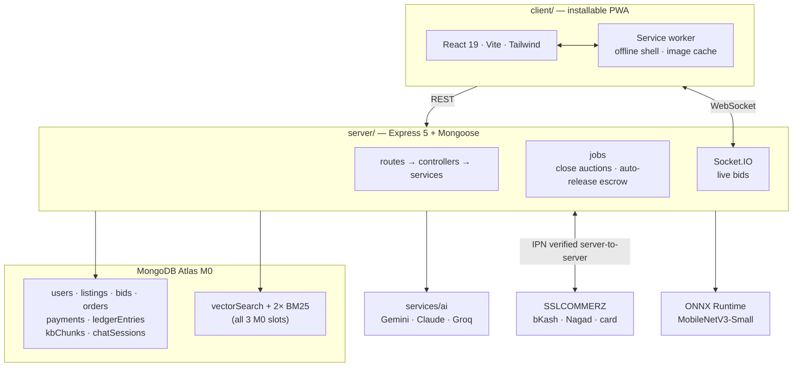

# KrishiBid

[](https://github.com/golammoula287/Krishibid_Software/actions/workflows/ci.yml)


A farmer-to-buyer **bidding marketplace** with **escrow payments**, **CNN crop-disease
detection**, and a **Bangla RAG advisory assistant**, built for smallholder farmers in
Bangladesh.

> **Live client:** <https://krishibid.vercel.app>
>
> **Status:** frontend deployed, 75 passing tests, verified end-to-end against live
> MongoDB Atlas and Gemini. The API is not deployed yet — it cannot run on serverless
> (interval jobs, WebSockets, native ONNX/sharp binaries), so it needs Render; see
> [Deployment](#deployment-free-tier). Until then the client loads but API calls fail.
> The disease model ships as a placeholder until the training notebook is run.

---

## The problem

A smallholder farmer in Bangladesh sells through layers of intermediaries who each
take a margin, with no visibility into a fair price. Separately, crop disease that a
photo could catch early is usually caught after yield is already lost, because expert
advice does not reach a non-English-speaking user on a low-end phone at the moment
they need it.

Three pillars address exactly that:

| Pillar | What it does |
|---|---|
| **Bidding marketplace** | Farmers list a lot; buyers bid in a live window; escrow holds the money until delivery |
| **Disease detection** | Photo of a leaf → top-3 diagnosis with confidence, and a remedy — or an explicit "not sure, see an officer" |
| **Bangla RAG advisor** | Farming questions in Bangla, answered **only** from a cited knowledge base |

---

## Architecture



Shared Zod schemas in `shared/` are the single source of truth for the API contract —
a field renamed on one side is a compile error on the other.

---

## Quick start

```bash
git clone <your-repo-url> && cd Krishibid
npm install
cp .env.example .env      # then fill in the blanks below
npm run seed              # demo users, 40 listings, one order awaiting payment
npm run dev               # server :5000 + client :5173
```

Open <http://localhost:5173> and use a **one-click demo login** — no signup needed.

### Minimum `.env` to boot

| Key | Where to get it |
|---|---|
| `MONGODB_URI` | [Atlas](https://www.mongodb.com/cloud/atlas/register) → free M0 cluster |
| `JWT_ACCESS_SECRET`, `JWT_REFRESH_SECRET` | `openssl rand -base64 48` (twice) |
| `GEMINI_API_KEY` | [AI Studio](https://aistudio.google.com/apikey) — free |

**Swapping the AI provider** is one env var: `AI_PROVIDER=gemini` (default), `claude`,
or `groq`. Only Gemini offers embeddings, so `GEMINI_API_KEY` is required either way —
the factory throws at boot if it is missing rather than silently returning no results.

Everything else is optional in development. Without Cloudinary, images are stored
inline; without SSLCOMMERZ, payment routes return 503; without the ONNX model,
`/api/diagnosis` returns 503 — the rest of the app runs regardless.

### Upgrading an existing deployment — run this FIRST

`users.email` is now **required and unique**. On a database whose users predate that, two things
break, both measured rather than assumed:

- every login calls `user.save()` to rotate the refresh-token hash, and mongoose validates the
  whole document — so a user with no email fails with `Path `email` is required` and **cannot log
  in at all**;
- the unique index cannot build over two documents with a missing email — they collide on null.

```bash
npm run migrate:emails -- --dry   # report only
npm run migrate:emails            # backfill, then build the unique index
```

It is idempotent. Accounts with no address get a placeholder at `@krishibid.invalid` — a domain
reserved by RFC 2606, so it can never deliver to a real stranger — marked **unverified**, because
nobody proved it. Those users set a real address from Account → Verify your email → "Wrong
address? Change it". Until they do, a farmer among them cannot list produce and a buyer stays at
the `basic` bid ceiling, which is the correct consequence of an unproven address rather than an
oversight.

Run it **before** the new server takes traffic. On Render: `npm run migrate:emails:prod`.

### Signing up, and why the codes go to email

Signup is four steps for a farmer and three for a buyer, because a farmer uploads identity
documents *before* their account exists and cannot log in until an admin approves it. A buyer is
created active and lands in the market immediately.

Every one-time code — signup, password reset, the `/signup/status` lookup — travels by **email**,
not SMS: there is no usable free SMS provider for Bangladesh. That is a real weakening of the
fraud story and it is not hidden anywhere in the UI. The phone number is still required and
unique, because it is how a counterparty reaches someone mid-trade, but it is never labelled
"verified" and the account page says so.

With `MAIL_PROVIDER=none` (the default) nothing is sent: the code is logged and returned in the
API response outside production, so the whole flow is usable with no mail account at all. Set
`MAIL_PROVIDER=resend` plus `RESEND_API_KEY` to send for real, and in development set
`ADMIN_NOTIFY_EMAIL` and `MAIL_REDIRECT_TO` to your own address — Resend's free tier refuses to
deliver anywhere else until you verify a domain, and the redirect makes that visible instead of
looking like mail that vanished.

---

## Full setup

### 1. Atlas search indexes

```bash
npm run create:indexes
```

Creates all three (vector + 2× BM25). **M0 allows a maximum of 3** — see
[ADR-003](docs/adr/ADR-003-atlas-index-budget.md). Atlas builds them asynchronously;
allow a minute.

### 2. Knowledge base

```bash
npm run ingest:kb
```

Chunks, embeds and upserts `server/src/scripts/kbSources.ts`. Idempotent — chunks are
keyed by content hash, so re-running updates rather than duplicating. Expand
`kbSources.ts` toward 300–600 chunks before a real demo; keep the real
title/URL/section on every document so citations resolve to something checkable.

### 3. Payments

Two modes, set with `PAYMENT_MODE`.

#### `mock` — demo escrow with no gateway account

```
PAYMENT_MODE=mock
```

Checkout renders an in-app simulated page with **Simulate success** and **Simulate
failure** buttons. It runs the *same* `capture()`, the same double-entry ledger
transaction and the same order transitions as a real payment — a demo that bypassed the
ledger would prove nothing about the escrow design.

Guard rails, because an endpoint that can mark payments captured is a real liability:

- The route is **not registered at all** unless `PAYMENT_MODE=mock`, so it 404s rather
  than relying on a runtime check inside the handler.
- The server **refuses to boot** with `PAYMENT_MODE=mock` and `SSLCZ_IS_LIVE=true`.
- Unlike the real IPN it **requires authentication** and the caller must be the order's
  own buyer. The real IPN cannot require auth (a gateway calls it) and earns trust by
  re-validating server-to-server instead; the mock has no external source of truth, so
  identity is the guard.
- Every simulated payment is flagged `simulated: true` **permanently**, and its ledger
  memos carry `[SIMULATED]` so a ledger export read on its own still shows what was real.
- The UI is styled as an obvious simulation rather than a convincing payment page. A
  realistic-looking mock checkout is indistinguishable from a phishing screen.

#### `sslcommerz` — the real gateway (sandbox)

Register for [sandbox credentials](https://developer.sslcommerz.com/registration/) and
set `SSLCZ_STORE_ID` / `SSLCZ_STORE_PASSWORD`.

> **`API_PUBLIC_URL` must be publicly reachable.** SSLCOMMERZ delivers the IPN
> server-to-server, so with `localhost` it never fires and payments sit in `pending`
> forever. Use a tunnel in development:
>
> ```bash
> cloudflared tunnel --url http://localhost:5000
> # then set API_PUBLIC_URL to the https URL it prints
> ```

### 4. Disease model (optional)

The repo ships a **placeholder** `labels.json` and no `.onnx`. To train:

```bash
cd ml && pip install -r requirements.txt
# run notebooks/train_disease_cnn.ipynb (Colab free GPU, ~10 min)
python export_onnx.py --checkpoint artifacts/best.pt --version v1
```

Then point `DISEASE_MODEL_PATH` at the exported file and restart. Check
`GET /api/diagnosis/health`.

---

## How the money works

Payment is **not** a redirect that flips a flag. The flow:

```
bid accepted → awaiting_payment
   buyer pays  → SSLCOMMERZ hosted checkout
   IPN         → signature check → server-to-server re-validate → amount compared
               → ledger: gateway_clearing −X, farmer_escrow +X   → confirmed
   farmer ships                                                   → in_transit
   buyer confirms (or 7-day auto-release)
               → ledger: escrow −X, available +net, revenue +commission → completed
```

Three things worth knowing:

- **Escrow is a ledger, not a vault.** Holding third-party funds needs a
  payment-institution licence, so money sits in the platform's merchant account and an
  immutable double-entry ledger records whose it is. Every transaction must sum to
  zero or nothing is written. Balances are always derived, never stored.
- **The browser redirect writes no state.** `/payment/success` is user-reachable, so
  only the verified IPN can move money.
- **Auto-release exists for the farmer.** Without it a buyer who stops responding
  strands the money forever. Raising a dispute freezes the clock.

Full reasoning: [ADR-006](docs/adr/ADR-006-escrow-payments.md).

---

## Testing

```bash
npm test          # 75 tests
npm run typecheck
npm run build
```

Runs against `MongoMemoryReplSet` — a **replica set, not a standalone `mongod`** —
because the accept-bid and payment paths use multi-document transactions that a
standalone rejects outright. Testing against a standalone would leave the code most
worth testing never executed.

### RAG retrieval evaluation

```bash
npm run seed && npm run ingest:kb   # prerequisites
npm run eval:rag                    # writes docs/rag-eval.md
```

Compares **dense-only vs hybrid vs hybrid+rerank** on a hand-labelled golden set
(`server/src/scripts/goldenSet.ts`), reporting recall@4, MRR, the refusal rate on
deliberately unanswerable questions, and citation validity. This exists so ADR-004's
claim that hybrid beats dense-only is **measured rather than asserted** — if the
numbers come out flat, the ADR is wrong and should change.

The golden set deliberately includes a question asking for a specific pesticide dose
the sources do not state. Inventing a number there is the most harmful failure this
pillar can produce, so it is tested rather than hoped about.

**First live run (8-chunk corpus):** refusal on unanswerable questions **100%**,
citation validity **100%** — both meaningful at any size. Retrieval recall@4 was
**72.7% for all three configurations**, i.e. hybrid showed no measurable gain. That is a
corpus-size artifact rather than a verdict: with 8 chunks and k=4, half the KB reaches
the context window regardless of ranking. Both legs were verified working independently
(BM25 correctly matched `Phytophthora infestans` to the Bangla late-blight document), so
the honest claim today is "implemented and mechanically correct, benefit unmeasured" —
see [ADR-004](docs/adr/ADR-004-hybrid-retrieval.md). Re-run at 300+ chunks to settle it.

> Needs a populated KB and live API quota, so it is **not** run in CI — the committed
> `docs/rag-eval.md` is the record.

### The two suites that matter most

- **50-way bid concurrency** — 50 buyers bid simultaneously; asserts exactly one
  active bid, that it *is* the listing's recorded winner, and that `version`
  incremented once per accepted bid. This test caught a real reconciliation race
  during development (documented in
  [ADR-005](docs/adr/ADR-005-bidding-concurrency.md)).
- **Ledger invariants** — refuses unbalanced, single-leg, zero-amount and non-integer
  postings; proves immutability; proves balances are derived and escrow drains to
  exactly zero on release.

---

## Layout

```
Krishibid/
├─ client/               React PWA
│  └─ src/{pages,components,lib,locales}
├─ server/               Express API
│  └─ src/{models,services,controllers,routes,middleware,jobs,sockets,utils,scripts}
├─ shared/src/           Zod schemas + types — the API contract
├─ ml/                   Training + ONNX export (never deployed)
├─ docs/adr/             Architecture decision records
└─ .github/workflows/    CI: typecheck → test → build → bundle budget
```

---

## Decisions

| ADR | Decision |
|---|---|
| [001](docs/adr/ADR-001-stack.md) | MERN + TypeScript, client/server split, Express 5 for native async errors |
| [002](docs/adr/ADR-002-ai-provider.md) | AI behind a provider interface; Gemini free tier default, Claude one env var away |
| [003](docs/adr/ADR-003-atlas-index-budget.md) | RAG inside Atlas; all 3 free-tier index slots allocated up front |
| [004](docs/adr/ADR-004-hybrid-retrieval.md) | Hybrid dense + BM25 fused with RRF — why not score normalisation |
| [005](docs/adr/ADR-005-bidding-concurrency.md) | Atomic conditional updates for bids, transactions for accepts |
| [006](docs/adr/ADR-006-escrow-payments.md) | Escrow as a double-entry ledger; IPN trust model |

---

## Deployment (free tier)

| Component | Host | Constraint |
|---|---|---|
| Client | **Vercel** ([live](https://krishibid.vercel.app)) | none meaningful |
| Server | Render / Fly.io | 512 MB RAM, sleeps when idle |
| Database | Atlas M0 | 512 MB, 3 search indexes |
| Images | Cloudinary | 25 GB bandwidth/month |
| AI | Gemini free tier | ~10 RPM / 1,500 RPD |

Free-tier caps are handled in code, not hoped away: a 24 h answer cache, per-user
hourly chat limits, and degradation to retrieval-only citations when the LLM quota is
exhausted (`degraded: true`, surfaced in the UI rather than hidden).

---

## Known limitations

- **The disease model is lab-trained.** PlantVillage images are single-leaf on uniform
  backgrounds; field accuracy will be materially lower. The API withholds any
  prediction below 0.60 confidence and refers the farmer to an extension officer
  instead of guessing.
- **Payouts are manual.** `farmer_available` means "owed and withdrawable", not
  "already sent".
- **Bids are online-only.** No offline bid queue — queuing a bid on a device that
  reconnects after the auction closed would create phantom bids. Deliberately not
  built.
- **The KB is a starter corpus.** Enough to prove the pipeline; expand before claiming
  coverage.

---

## Roadmap

Weather and pest alerts · price/yield forecasting · government subsidy aggregator ·
agri-officer analytics dashboard · automated payouts · native app.

Deferred on purpose — see the reasoning in the project plan rather than treating these
as missing features.
